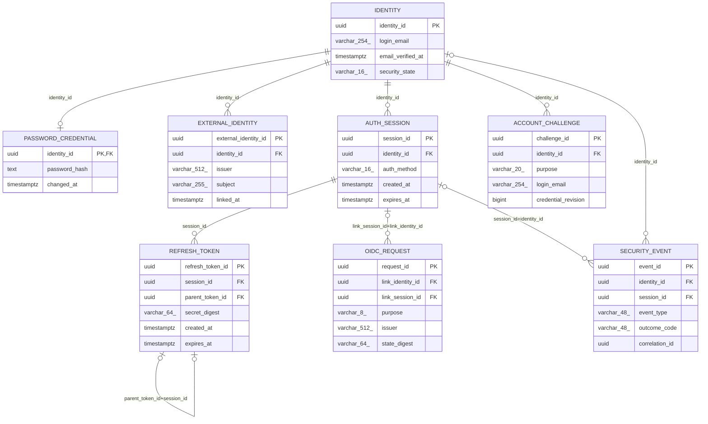

# Authentication Database Schema

```mermaid
erDiagram
  IDENTITY ||--o| PASSWORD_CREDENTIAL : "identity_id"
  IDENTITY ||--o{ EXTERNAL_IDENTITY : "identity_id"
  IDENTITY ||--o{ AUTH_SESSION : "identity_id"
  AUTH_SESSION ||--o{ REFRESH_TOKEN : "session_id"
  REFRESH_TOKEN o|--o| REFRESH_TOKEN : "parent_token_id+session_id"
  IDENTITY ||--o{ ACCOUNT_CHALLENGE : "identity_id"
  AUTH_SESSION o|--o{ OIDC_REQUEST : "link_session_id+link_identity_id"
  IDENTITY o|--o{ SECURITY_EVENT : "identity_id"
  AUTH_SESSION o|--o{ SECURITY_EVENT : "session_id+identity_id"
  IDENTITY {
    uuid identity_id PK
    varchar_254_ login_email
    timestamptz email_verified_at
    varchar_16_ security_state
  }
  PASSWORD_CREDENTIAL {
    uuid identity_id PK,FK
    text password_hash
    timestamptz changed_at
  }
  EXTERNAL_IDENTITY {
    uuid external_identity_id PK
    uuid identity_id FK
    varchar_512_ issuer
    varchar_255_ subject
    timestamptz linked_at
  }
  AUTH_SESSION {
    uuid session_id PK
    uuid identity_id FK
    varchar_16_ auth_method
    timestamptz created_at
    timestamptz expires_at
  }
  REFRESH_TOKEN {
    uuid refresh_token_id PK
    uuid session_id FK
    uuid parent_token_id FK
    varchar_64_ secret_digest
    timestamptz created_at
    timestamptz expires_at
  }
  ACCOUNT_CHALLENGE {
    uuid challenge_id PK
    uuid identity_id FK
    varchar_20_ purpose
    varchar_254_ login_email
    bigint credential_revision
  }
  OIDC_REQUEST {
    uuid request_id PK
    uuid link_identity_id FK
    uuid link_session_id FK
    varchar_8_ purpose
    varchar_512_ issuer
    varchar_64_ state_digest
  }
  SECURITY_EVENT {
    uuid event_id PK
    uuid identity_id FK
    uuid session_id FK
    varchar_48_ event_type
    varchar_48_ outcome_code
    uuid correlation_id
  }
```

[DBML source](schema.dbml)
