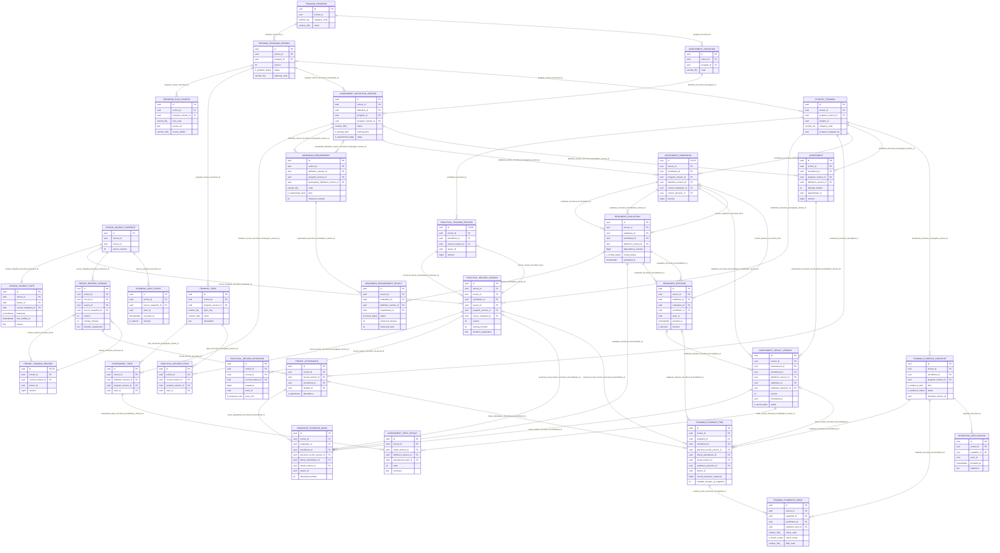

# Learning Tracking Database Schema

```mermaid
erDiagram
  TRAINING_PROGRAM ||--o{ TRAINING_PROGRAM_VERSION : "program_id+school_id"
  TRAINING_PROGRAM_VERSION ||--o{ PROGRAM_RULE_SOURCE : "program_version_id+school_id"
  TRAINING_PROGRAM_VERSION ||--o{ TRAINING_TOPIC : "program_version_id+school_id"
  TRAINING_PROGRAM ||--o{ ASSESSMENT_DEFINITION : "program_id+school_id"
  ASSESSMENT_DEFINITION ||--o{ ASSESSMENT_DEFINITION_VERSION : "definition_id+school_id+program_id"
  TRAINING_PROGRAM_VERSION ||--o{ ASSESSMENT_DEFINITION_VERSION : "program_version_id+school_id+program_id"
  ASSESSMENT_DEFINITION_VERSION ||--o{ ASSESSMENT_TOPIC : "definition_version_id+school_id+program_version_id"
  TRAINING_TOPIC ||--o{ ASSESSMENT_TOPIC : "topic_id+school_id+program_version_id"
  ASSESSMENT_DEFINITION_VERSION ||--o{ ADMISSION_REQUIREMENT : "definition_version_id+school_id+program_version_id"
  ASSESSMENT_DEFINITION_VERSION o|--o{ ADMISSION_REQUIREMENT : "prerequisite_definition_version_id+school_id+program_version_id"
  TRAINING_PROGRAM_VERSION o|--o{ STUDENT_TRAINING : "program_version_id+school_id"
  LESSON_SOURCE_SNAPSHOT ||--o| LESSON_SOURCE_STATE : "current_snapshot_id+school_id+lesson_id"
  STUDENT_TRAINING ||--o{ PRACTICAL_TRAINING_RECORD : "enrollment_id+school_id"
  PRACTICAL_TRAINING_RECORD ||--o{ PRACTICAL_RECORD_VERSION : "record_id+school_id+enrollment_id+lesson_id"
  STUDENT_TRAINING ||--o{ PRACTICAL_RECORD_VERSION : "enrollment_id+school_id+program_version_id"
  LESSON_SOURCE_SNAPSHOT ||--o{ PRACTICAL_RECORD_VERSION : "source_snapshot_id+school_id+lesson_id"
  PRACTICAL_RECORD_VERSION o|--o| PRACTICAL_TRAINING_RECORD : "current_version_id+school_id+id"
  PRACTICAL_RECORD_VERSION ||--o{ PRACTICAL_RECORD_TOPIC : "record_version_id+school_id+program_version_id"
  TRAINING_TOPIC ||--o{ PRACTICAL_RECORD_TOPIC : "topic_id+school_id+program_version_id"
  PRACTICAL_RECORD_VERSION ||--o{ PRACTICAL_RECORD_RESPONSE : "record_version_id+school_id+record_id"
  THEORY_TRAINING_RECORD ||--o{ THEORY_RECORD_VERSION : "record_id+school_id+lesson_id"
  LESSON_SOURCE_SNAPSHOT ||--o{ THEORY_RECORD_VERSION : "source_snapshot_id+school_id+lesson_id"
  THEORY_RECORD_VERSION o|--o| THEORY_TRAINING_RECORD : "current_version_id+school_id+id"
  THEORY_RECORD_VERSION ||--o{ THEORY_ATTENDANCE : "record_version_id+school_id"
  STUDENT_TRAINING ||--o{ THEORY_ATTENDANCE : "enrollment_id+school_id+student_id"
  STUDENT_TRAINING ||--o{ ASSESSMENT_READINESS : "enrollment_id+school_id+program_version_id"
  ASSESSMENT_DEFINITION_VERSION ||--o{ ASSESSMENT_READINESS : "definition_version_id+school_id+program_version_id"
  ASSESSMENT_READINESS ||--o{ READINESS_EVALUATION : "readiness_id+school_id+enrollment_id"
  ASSESSMENT_READINESS ||--o{ READINESS_EVALUATION : "readiness_id+school_id+definition_version_id"
  READINESS_EVALUATION o|--o| ASSESSMENT_READINESS : "current_evaluation_id+school_id+id"
  READINESS_EVALUATION ||--o{ READINESS_REQUIREMENT_RESULT : "evaluation_id+school_id+definition_version_id"
  ADMISSION_REQUIREMENT ||--o{ READINESS_REQUIREMENT_RESULT : "requirement_id+school_id+definition_version_id"
  READINESS_EVALUATION ||--o{ READINESS_EVIDENCE_BASIS : "evaluation_id+school_id+enrollment_id"
  PRACTICAL_RECORD_VERSION o|--o{ READINESS_EVIDENCE_BASIS : "practical_record_version_id+school_id+enrollment_id"
  THEORY_ATTENDANCE o|--o{ READINESS_EVIDENCE_BASIS : "theory_attendance_id+school_id+enrollment_id"
  ASSESSMENT_RESULT_VERSION o|--o{ READINESS_EVIDENCE_BASIS : "result_version_id+school_id+enrollment_id"
  READINESS_EVALUATION ||--o{ READINESS_DECISION : "evaluation_id+school_id+readiness_id"
  READINESS_EVALUATION ||--o{ READINESS_DECISION : "evaluation_id+school_id+enrollment_id"
  READINESS_DECISION o|--o| ASSESSMENT_READINESS : "current_decision_id+school_id+id"
  STUDENT_TRAINING ||--o{ ASSESSMENT : "enrollment_id+school_id+program_version_id"
  ASSESSMENT_DEFINITION_VERSION ||--o{ ASSESSMENT : "definition_version_id+school_id+program_version_id"
  ASSESSMENT ||--o{ ASSESSMENT_RESULT_VERSION : "assessment_id+school_id+enrollment_id+definition_version_id"
  ASSESSMENT_READINESS o|--o{ ASSESSMENT_RESULT_VERSION : "readiness_id+school_id+enrollment_id+definition_version_id"
  READINESS_DECISION o|--o{ ASSESSMENT_RESULT_VERSION : "readiness_decision_id+school_id+readiness_id"
  ASSESSMENT_RESULT_VERSION ||--o{ ASSESSMENT_TOPIC_RESULT : "result_version_id+school_id+definition_version_id"
  ASSESSMENT_TOPIC ||--o{ ASSESSMENT_TOPIC_RESULT : "assessment_topic_id+school_id+definition_version_id"
  STUDENT_TRAINING ||--o{ TRAINING_EVIDENCE_SNAPSHOT : "enrollment_id+school_id+program_version_id"
  TRAINING_EVIDENCE_SNAPSHOT ||--o{ TRAINING_EVIDENCE_ITEM : "snapshot_id+school_id+enrollment_id"
  PRACTICAL_RECORD_VERSION o|--o{ TRAINING_EVIDENCE_ITEM : "practical_record_version_id+school_id+enrollment_id"
  ASSESSMENT_RESULT_VERSION o|--o{ TRAINING_EVIDENCE_ITEM : "result_version_id+school_id+enrollment_id"
  THEORY_ATTENDANCE o|--o{ TRAINING_EVIDENCE_ITEM : "theory_attendance_id+school_id+enrollment_id"
  READINESS_DECISION o|--o{ TRAINING_EVIDENCE_ITEM : "readiness_decision_id+school_id+enrollment_id"
  TRAINING_EVIDENCE_SNAPSHOT ||--o{ TRAINING_EVIDENCE_CHECK : "snapshot_id+school_id+enrollment_id"
  TRAINING_EVIDENCE_ITEM o|--o{ TRAINING_EVIDENCE_CHECK : "evidence_item_id+school_id+snapshot_id"
  TRAINING_EVIDENCE_SNAPSHOT ||--o{ REPORTING_DECLARATION : "snapshot_id+school_id"
  LESSON_SOURCE_SNAPSHOT o|--o{ LEARNING_AUDIT_EVENT : "source_snapshot_id+school_id"
  TRAINING_PROGRAM {
    uuid id PK
    uuid school_id
    varchar_16_ category_code
    varchar_200_ name
  }
  TRAINING_PROGRAM_VERSION {
    uuid id PK
    uuid school_id FK
    uuid program_id FK
    int version
    lt_program_status status
    varchar_80_ pathway_code
  }
  PROGRAM_RULE_SOURCE {
    uuid id PK
    uuid school_id FK
    uuid program_version_id FK
    varchar_80_ rule_code
    text source_uri
    varchar_200_ source_edition
  }
  TRAINING_TOPIC {
    uuid id PK
    uuid school_id FK
    uuid program_version_id FK
    varchar_80_ topic_key
    varchar_200_ name
    text description
  }
  ASSESSMENT_DEFINITION {
    uuid id PK
    uuid school_id FK
    uuid program_id FK
    varchar_80_ code
  }
  ASSESSMENT_DEFINITION_VERSION {
    uuid id PK
    uuid school_id FK
    uuid definition_id FK
    uuid program_id FK
    uuid program_version_id FK
    varchar_200_ name
    lt_training_kind training_kind
    lt_assessment_stage stage
  }
  ASSESSMENT_TOPIC {
    uuid id PK
    uuid school_id FK
    uuid definition_version_id FK
    uuid program_version_id FK
    uuid topic_id FK
  }
  ADMISSION_REQUIREMENT {
    uuid id PK
    uuid school_id FK
    uuid definition_version_id FK
    uuid program_version_id FK
    uuid prerequisite_definition_version_id FK
    varchar_80_ code
    lt_requirement_kind kind
    int minimum_minutes
  }
  STUDENT_TRAINING {
    uuid id PK
    uuid school_id FK
    uuid program_version_id FK
    uuid student_id
    varchar_16_ category_code
    uuid program_assigned_by
  }
  LESSON_SOURCE_SNAPSHOT {
    uuid id PK
    uuid school_id
    uuid lesson_id
    int lesson_revision
  }
  LESSON_SOURCE_STATE {
    uuid id PK
    uuid school_id FK
    uuid lesson_id FK
    uuid current_snapshot_id FK
    lt_freshness freshness
    timestamptz last_verified_at
    text reason
  }
  PRACTICAL_TRAINING_RECORD {
    uuid id PK,FK
    uuid school_id FK
    uuid enrollment_id FK
    uuid current_version_id FK
    uuid lesson_id
    bigint revision
  }
  PRACTICAL_RECORD_VERSION {
    uuid id PK
    uuid school_id FK
    uuid record_id FK
    uuid enrollment_id FK
    uuid lesson_id FK
    uuid program_version_id FK
    uuid source_snapshot_id FK
    int version
    int training_minutes
    text duration_explanation
  }
  PRACTICAL_RECORD_TOPIC {
    uuid id PK
    uuid school_id FK
    uuid record_version_id FK
    uuid program_version_id FK
    uuid topic_id FK
  }
  PRACTICAL_RECORD_RESPONSE {
    uuid id PK
    uuid school_id FK
    uuid record_id FK
    uuid record_version_id FK
    bigint sequence
    uuid actor_id
    lt_response_role actor_role
  }
  THEORY_TRAINING_RECORD {
    uuid id PK,FK
    uuid school_id FK
    uuid current_version_id FK
    uuid lesson_id
    bigint revision
  }
  THEORY_RECORD_VERSION {
    uuid id PK
    uuid school_id FK
    uuid record_id FK
    uuid lesson_id FK
    uuid source_snapshot_id FK
    int version
    int training_minutes
    text duration_explanation
  }
  THEORY_ATTENDANCE {
    uuid id PK
    uuid school_id FK
    uuid record_version_id FK
    uuid enrollment_id FK
    uuid student_id FK
    lt_attendance attendance
  }
  ASSESSMENT_READINESS {
    uuid id PK,FK
    uuid school_id FK
    uuid enrollment_id FK
    uuid program_version_id FK
    uuid definition_version_id FK
    uuid current_evaluation_id FK
    uuid current_decision_id FK
    bigint revision
  }
  READINESS_EVALUATION {
    uuid id PK
    uuid school_id FK
    uuid readiness_id FK
    uuid enrollment_id FK
    uuid definition_version_id FK
    bigint dependency_revision
    lt_formal_status formal_status
    timestamptz evaluated_at
  }
  READINESS_REQUIREMENT_RESULT {
    uuid id PK
    uuid school_id FK
    uuid evaluation_id FK
    uuid definition_version_id FK
    uuid requirement_id FK
    lt_formal_status status
    int observed_minutes
    int observed_mark
  }
  READINESS_EVIDENCE_BASIS {
    uuid id PK
    uuid school_id FK
    uuid evaluation_id FK
    uuid enrollment_id FK
    uuid practical_record_version_id FK
    uuid theory_attendance_id FK
    uuid result_version_id FK
    uuid lesson_id
    int observed_minutes
  }
  READINESS_DECISION {
    uuid id PK
    uuid school_id FK
    uuid readiness_id FK
    uuid evaluation_id FK
    uuid enrollment_id FK
    uuid actor_id
    timestamptz decided_at
    lt_decision decision
  }
  ASSESSMENT {
    uuid id PK
    uuid school_id FK
    uuid enrollment_id FK
    uuid program_version_id FK
    uuid definition_version_id FK
    int attempt_number
    uuid appointment_id
    bigint revision
  }
  ASSESSMENT_RESULT_VERSION {
    uuid id PK
    uuid school_id FK
    uuid assessment_id FK
    uuid enrollment_id FK
    uuid definition_version_id FK
    uuid readiness_id FK
    uuid readiness_decision_id FK
    int version
    uuid command_id
    lt_result_status status
  }
  ASSESSMENT_TOPIC_RESULT {
    uuid id PK
    uuid school_id FK
    uuid result_version_id FK
    uuid definition_version_id FK
    uuid assessment_topic_id FK
    int mark
    text comment
  }
  TRAINING_EVIDENCE_SNAPSHOT {
    uuid id PK
    uuid school_id FK
    uuid enrollment_id FK
    uuid program_version_id FK
    lt_evidence_kind kind
    lt_evidence_status status
    uuid checklist_version_id
  }
  TRAINING_EVIDENCE_ITEM {
    uuid id PK
    uuid school_id FK
    uuid snapshot_id FK
    uuid enrollment_id FK
    uuid practical_record_version_id FK
    uuid theory_attendance_id FK
    uuid result_version_id FK
    uuid readiness_decision_id FK
    uuid lesson_id
    bigint record_response_sequence
    int credited_minutes_at_snapshot
  }
  TRAINING_EVIDENCE_CHECK {
    uuid id PK
    uuid school_id FK
    uuid snapshot_id FK
    uuid enrollment_id FK
    uuid evidence_item_id FK
    varchar_100_ check_code
    lt_check_scope check_scope
    varchar_100_ field_code
  }
  REPORTING_DECLARATION {
    uuid id PK
    uuid school_id FK
    uuid snapshot_id FK
    uuid actor_id
    timestamptz declared_at
    text statement
  }
  LEARNING_AUDIT_EVENT {
    uuid id PK
    uuid school_id FK
    uuid source_snapshot_id FK
    uuid actor_id
    timestamptz occurred_at
    lt_channel channel
  }
```

[DBML source](schema.dbml)
