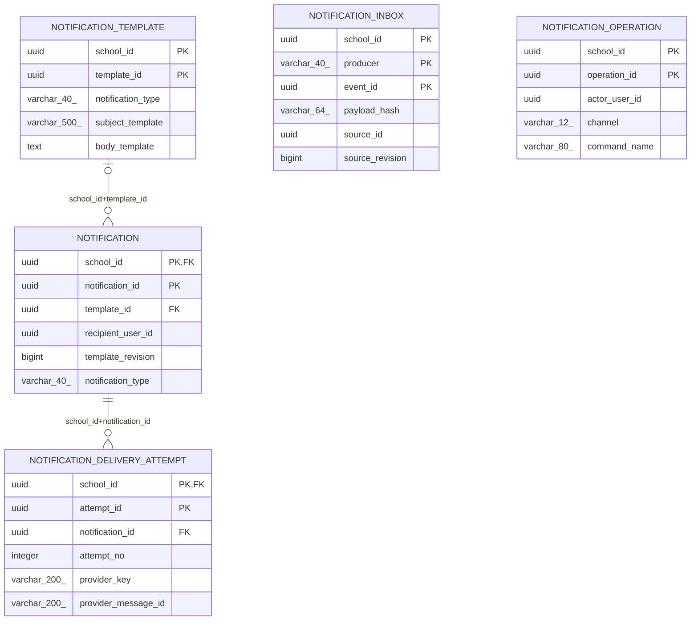

# Notifications Database Schema

```mermaid
erDiagram
  NOTIFICATION_TEMPLATE o|--o{ NOTIFICATION : "school_id+template_id"
  NOTIFICATION ||--o{ NOTIFICATION_DELIVERY_ATTEMPT : "school_id+notification_id"
  NOTIFICATION_TEMPLATE {
    uuid school_id PK
    uuid template_id PK
    varchar_40_ notification_type
    varchar_500_ subject_template
    text body_template
  }
  NOTIFICATION {
    uuid school_id PK,FK
    uuid notification_id PK
    uuid template_id FK
    uuid recipient_user_id
    bigint template_revision
    varchar_40_ notification_type
  }
  NOTIFICATION_DELIVERY_ATTEMPT {
    uuid school_id PK,FK
    uuid attempt_id PK
    uuid notification_id FK
    integer attempt_no
    varchar_200_ provider_key
    varchar_200_ provider_message_id
  }
  NOTIFICATION_INBOX {
    uuid school_id PK
    varchar_40_ producer PK
    uuid event_id PK
    varchar_64_ payload_hash
    uuid source_id
    bigint source_revision
  }
  NOTIFICATION_OPERATION {
    uuid school_id PK
    uuid operation_id PK
    uuid actor_user_id
    varchar_12_ channel
    varchar_80_ command_name
  }
```

[DBML source](schema.dbml)
