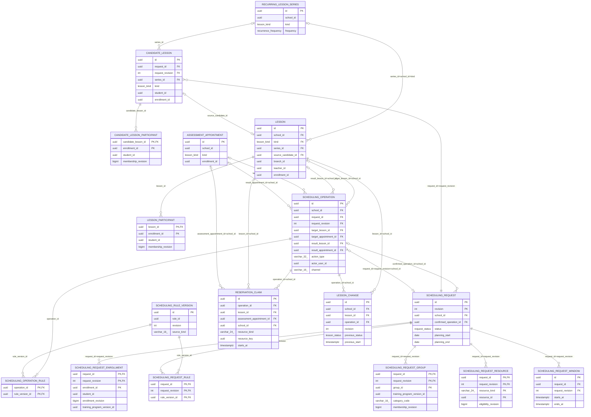

# Scheduling Database Schema

```mermaid
erDiagram
  SCHEDULING_RULE_VERSION ||--o{ SCHEDULING_REQUEST_RULE : "rule_version_id"
  CANDIDATE_LESSON ||--o{ CANDIDATE_LESSON_PARTICIPANT : "candidate_lesson_id"
  LESSON ||--o{ LESSON_PARTICIPANT : "lesson_id"
  SCHEDULING_REQUEST ||--o{ SCHEDULING_REQUEST_ENROLLMENT : "request_id+request_revision"
  SCHEDULING_REQUEST ||--o{ SCHEDULING_REQUEST_GROUP : "request_id+request_revision"
  SCHEDULING_REQUEST ||--o{ SCHEDULING_REQUEST_RESOURCE : "request_id+request_revision"
  SCHEDULING_REQUEST ||--o{ SCHEDULING_REQUEST_WINDOW : "request_id+request_revision"
  SCHEDULING_REQUEST ||--o{ SCHEDULING_REQUEST_RULE : "request_id+request_revision"
  SCHEDULING_REQUEST ||--o{ CANDIDATE_LESSON : "request_id+request_revision"
  RECURRING_LESSON_SERIES o|--o{ LESSON : "series_id+school_id+kind"
  SCHEDULING_REQUEST o|--o{ SCHEDULING_OPERATION : "request_id+request_revision+school_id"
  SCHEDULING_OPERATION o|--o{ SCHEDULING_REQUEST : "confirmed_operation_id+school_id"
  SCHEDULING_OPERATION ||--o{ RESERVATION_CLAIM : "operation_id+school_id"
  LESSON o|--o{ RESERVATION_CLAIM : "lesson_id+school_id"
  LESSON ||--o{ LESSON_CHANGE : "lesson_id+school_id"
  SCHEDULING_OPERATION ||--o{ LESSON_CHANGE : "operation_id+school_id"
  CANDIDATE_LESSON o|--o| LESSON : "source_candidate_id"
  RECURRING_LESSON_SERIES o|--o{ CANDIDATE_LESSON : "series_id"
  ASSESSMENT_APPOINTMENT o|--o{ RESERVATION_CLAIM : "assessment_appointment_id+school_id"
  LESSON o|--o{ SCHEDULING_OPERATION : "target_lesson_id+school_id"
  LESSON o|--o{ SCHEDULING_OPERATION : "result_lesson_id+school_id"
  ASSESSMENT_APPOINTMENT o|--o{ SCHEDULING_OPERATION : "target_appointment_id+school_id"
  ASSESSMENT_APPOINTMENT o|--o{ SCHEDULING_OPERATION : "result_appointment_id+school_id"
  SCHEDULING_OPERATION ||--o{ SCHEDULING_OPERATION_RULE : "operation_id"
  SCHEDULING_RULE_VERSION ||--o{ SCHEDULING_OPERATION_RULE : "rule_version_id"
  SCHEDULING_REQUEST {
    uuid id PK
    int revision PK
    uuid school_id FK
    uuid confirmed_operation_id FK
    request_status status
    date planning_start
    date planning_end
  }
  SCHEDULING_REQUEST_ENROLLMENT {
    uuid request_id PK,FK
    int request_revision PK,FK
    uuid enrollment_id PK
    uuid student_id
    bigint enrollment_revision
    uuid training_program_version_id
  }
  SCHEDULING_REQUEST_GROUP {
    uuid request_id PK,FK
    int request_revision PK,FK
    uuid group_id PK
    uuid training_program_version_id
    varchar_16_ category_code
    bigint membership_revision
  }
  SCHEDULING_REQUEST_RESOURCE {
    uuid request_id PK,FK
    int request_revision PK,FK
    varchar_24_ resource_kind PK
    uuid resource_id PK
    bigint eligibility_revision
  }
  SCHEDULING_REQUEST_WINDOW {
    uuid id PK
    uuid request_id FK
    int request_revision FK
    timestamptz starts_at
    timestamptz ends_at
  }
  SCHEDULING_RULE_VERSION {
    uuid id PK
    uuid rule_id
    int revision
    varchar_16_ source_kind
  }
  SCHEDULING_REQUEST_RULE {
    uuid request_id PK,FK
    int request_revision PK,FK
    uuid rule_version_id PK,FK
  }
  SCHEDULING_OPERATION_RULE {
    uuid operation_id PK,FK
    uuid rule_version_id PK,FK
  }
  CANDIDATE_LESSON {
    uuid id PK
    uuid request_id FK
    int request_revision FK
    uuid series_id FK
    lesson_kind kind
    uuid student_id
    uuid enrollment_id
  }
  CANDIDATE_LESSON_PARTICIPANT {
    uuid candidate_lesson_id PK,FK
    uuid enrollment_id PK
    uuid student_id
    bigint membership_revision
  }
  RECURRING_LESSON_SERIES {
    uuid id PK
    uuid school_id
    lesson_kind kind
    recurrence_frequency frequency
  }
  LESSON {
    uuid id PK
    uuid school_id FK
    lesson_kind kind FK
    uuid series_id FK
    uuid source_candidate_id FK
    uuid branch_id
    uuid teacher_id
    uuid enrollment_id
  }
  LESSON_PARTICIPANT {
    uuid lesson_id PK,FK
    uuid enrollment_id PK
    uuid student_id
    bigint membership_revision
  }
  SCHEDULING_OPERATION {
    uuid id PK
    uuid school_id FK
    uuid request_id FK
    int request_revision FK
    uuid target_lesson_id FK
    uuid target_appointment_id FK
    uuid result_lesson_id FK
    uuid result_appointment_id FK
    varchar_32_ action_type
    uuid actor_user_id
    varchar_16_ channel
  }
  RESERVATION_CLAIM {
    uuid id PK
    uuid operation_id FK
    uuid lesson_id FK
    uuid assessment_appointment_id FK
    uuid school_id FK
    varchar_24_ resource_kind
    uuid resource_key
    timestamptz starts_at
  }
  LESSON_CHANGE {
    uuid id PK
    uuid school_id FK
    uuid lesson_id FK
    uuid operation_id FK
    int revision
    lesson_status previous_status
    timestamptz previous_start
  }
  ASSESSMENT_APPOINTMENT {
    uuid id PK
    uuid school_id
    lesson_kind kind
    uuid enrollment_id
  }
```

[DBML source](schema.dbml)
