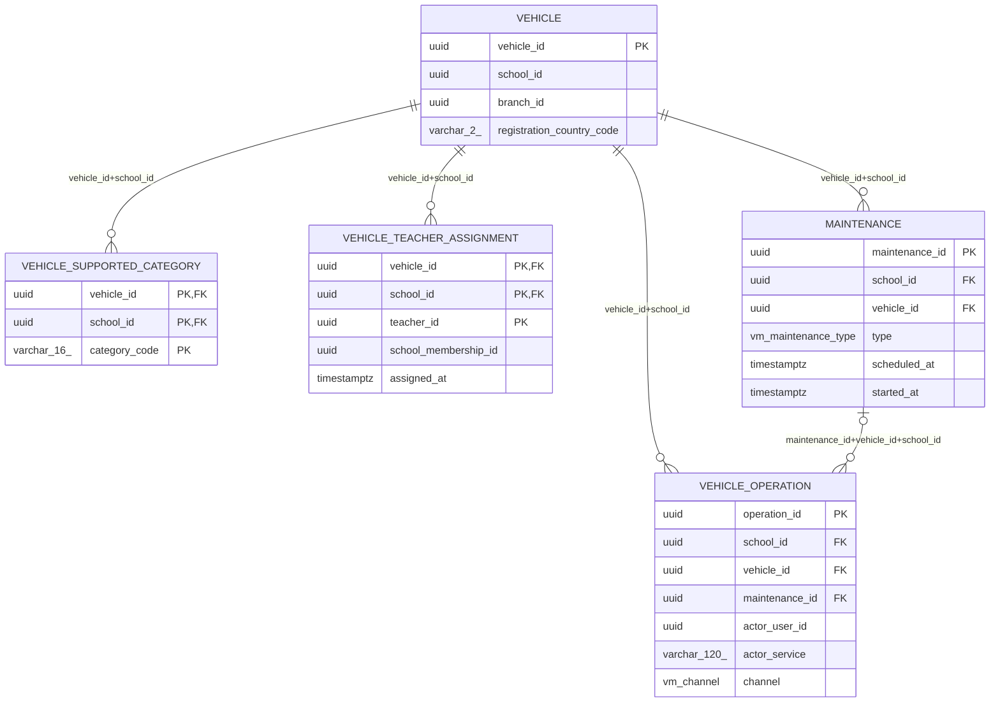

# Vehicle Management Database Schema

```mermaid
erDiagram
  VEHICLE ||--o{ VEHICLE_SUPPORTED_CATEGORY : "vehicle_id+school_id"
  VEHICLE ||--o{ VEHICLE_TEACHER_ASSIGNMENT : "vehicle_id+school_id"
  VEHICLE ||--o{ MAINTENANCE : "vehicle_id+school_id"
  VEHICLE ||--o{ VEHICLE_OPERATION : "vehicle_id+school_id"
  MAINTENANCE o|--o{ VEHICLE_OPERATION : "maintenance_id+vehicle_id+school_id"
  VEHICLE {
    uuid vehicle_id PK
    uuid school_id
    uuid branch_id
    varchar_2_ registration_country_code
  }
  VEHICLE_SUPPORTED_CATEGORY {
    uuid vehicle_id PK,FK
    uuid school_id PK,FK
    varchar_16_ category_code PK
  }
  VEHICLE_TEACHER_ASSIGNMENT {
    uuid vehicle_id PK,FK
    uuid school_id PK,FK
    uuid teacher_id PK
    uuid school_membership_id
    timestamptz assigned_at
  }
  MAINTENANCE {
    uuid maintenance_id PK
    uuid school_id FK
    uuid vehicle_id FK
    vm_maintenance_type type
    timestamptz scheduled_at
    timestamptz started_at
  }
  VEHICLE_OPERATION {
    uuid operation_id PK
    uuid school_id FK
    uuid vehicle_id FK
    uuid maintenance_id FK
    uuid actor_user_id
    varchar_120_ actor_service
    vm_channel channel
  }
```

[DBML source](schema.dbml)
